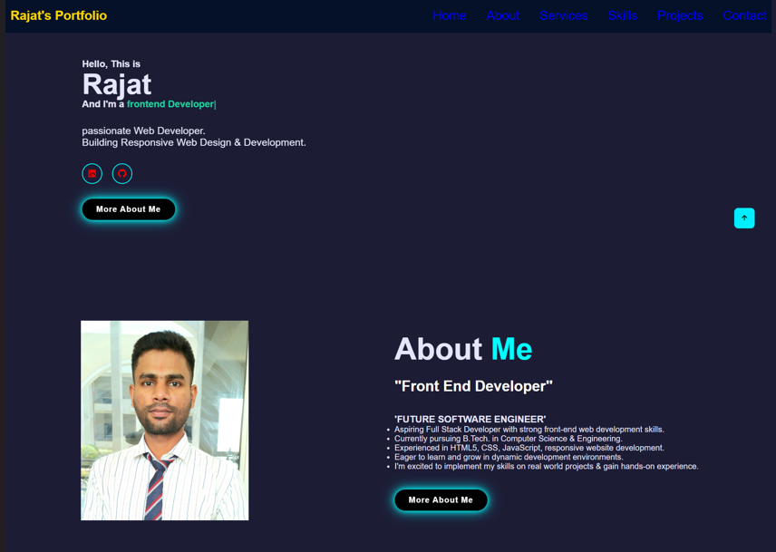

# Professional-portfolio
# 🚀 Personal Portfolio

A clean, responsive, and modern personal portfolio website built to showcase my technical skills, projects, and professional journey.



## 🌐 Live Demo
You can view the live website here: **[Live Portfolio Link](https://rajat-sde.github.io/Professional-portfolio/)**

---

## ✨ Features
* **Responsive UI:** Fully optimized for mobile, tablet, and desktop screens.
* **Interactive Elements:** Smooth navigation and dynamic transitions powered by JavaScript.
* **Project Showcase:** Detailed cards highlighting my latest work with visual previews.
* **Contact Integration:** Easy-to-find links for LinkedIn, GitHub, and email.

## 🛠️ Tech Stack
* **HTML5:** Semantic structure for better SEO and accessibility.
* **CSS3:** Custom styling with Flexbox and Grid layouts.
* **JavaScript:** Logic for interactive components and animations.

## 📂 Project Structure
```text
├── index.html        # Main entry point
├── portfolio.css     # Custom styles and layouts
├── portfolio.js      # Interactive logic & animations
├── Rajat.jpg         # Profile image
└── portimg.png       # Portfolio screenshots

# 🚀  Getting Started
To run this project locally:

# Clone the repository:

Bash
git clone [https://github.com/Rajat-sde/Professional-portfolio.git](https://github.com/Rajat-sde/Professional-portfolio.git)
Navigate to the folder:

Bash
cd Professional-portfolio
Open the project:
Simply open index.html in your favorite browser.

# 👨‍💻 # About Me
I am a passionate Software Development Engineer (SDE) focused on building user-centric web applications. This portfolio is a reflection of my dedication to clean code and efficient design.

# Connect with me:

GitHub: @Rajat-sde

LinkedIn: https://www.linkedin.com/in/rajatcse?utm_source=share_via&utm_content=profile&utm_medium=member_android

# Built with ❤️ by Rajat

---

### 💡 Quick Tips for Customization:
* **LinkedIn Link:** Replace `[Your LinkedIn Profile Link]` with your actual URL.
* **Images:** I used `portimg.png` for the main banner as it appears to be your site screenshot. If you'd rather show your face at the top, change it to `Rajat.jpg`.
* **Live Link:** I've pre-formatted the link for [GitHub Pages](https://rajat-sde.github.io/Professional-portfolio/), which appears to be where your deployment is hosted.
